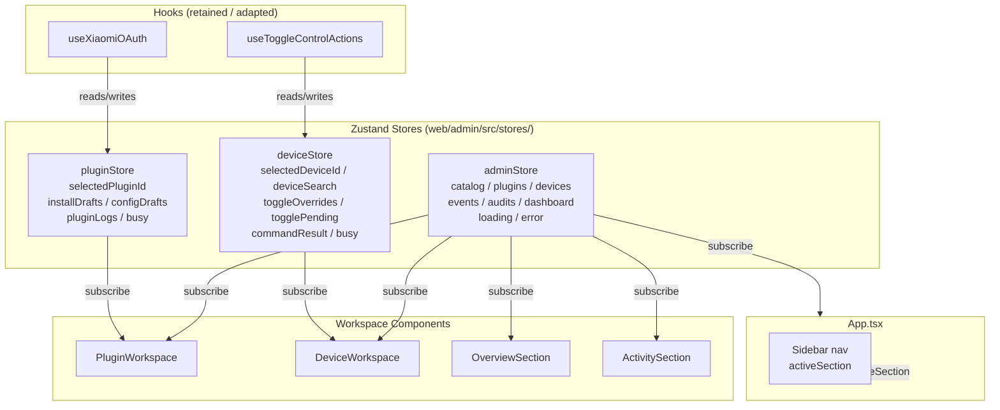
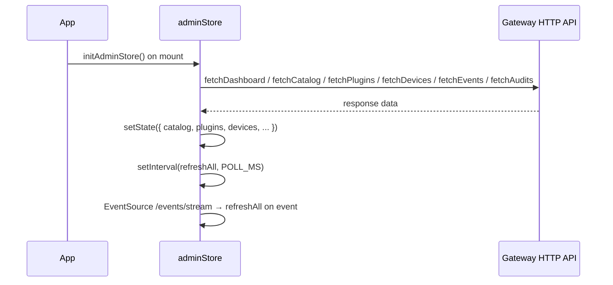
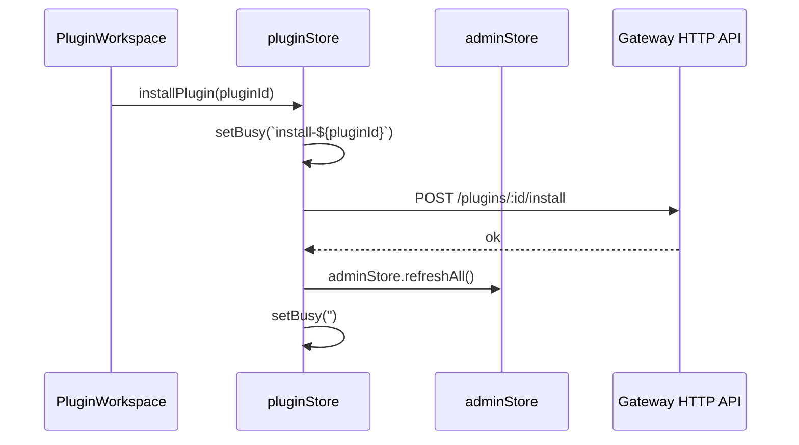
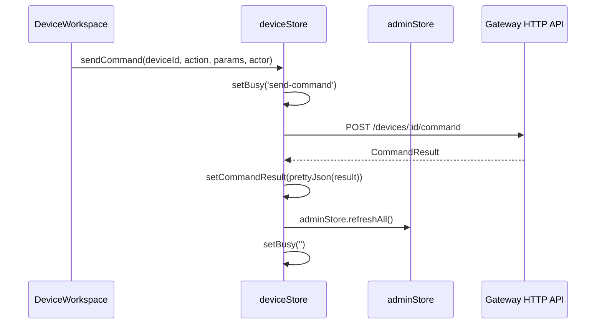

# Design Document: Admin Console Zustand Refactor

## Overview

当前 `App.tsx` 承载了大量本地状态和跨组件 props 透传，导致组件耦合严重、Props 类型膨胀。本次重构引入 Zustand 管理来自后端的全局数据，同时将各工作区的 UI 状态下沉到对应子组件，使 `App.tsx` 仅负责布局和 section 切换。

重构范围限定在 `web/admin/src/` 目录内，不涉及后端 API、Go 代码或插件协议。所有数据仍通过现有 gateway HTTP API 读写，不引入任何旁路集成路径。

## Architecture



## Sequence Diagrams

### 初始加载与轮询



### Plugin 操作流（Install / Enable / SaveConfig）



### Device 命令流



## Components and Interfaces

### adminStore

**Purpose**: 持有所有来自后端的服务端数据，以及全局 loading/error 状态。替代 `useAdminConsole` 中的 `state` 部分。

**Interface**:
```typescript
interface AdminState {
  dashboard: DashboardSummary | null;
  catalog: CatalogPlugin[];
  plugins: PluginRuntimeView[];
  devices: DeviceView[];
  events: EventRecord[];
  audits: AuditRecord[];
  loading: boolean;
  error: string | null;
}

interface AdminActions {
  refreshAll: () => Promise<void>;
  reportError: (message: string) => void;
  initPolling: () => () => void; // returns cleanup fn
}

type AdminStore = AdminState & AdminActions;
```

**Responsibilities**:
- 封装所有 `fetchXxx` API 调用
- 维护轮询定时器和 SSE EventSource（通过 `initPolling`）
- 暴露 `refreshAll` 供其他 store 的 action 调用
- 不持有任何 UI 选中状态

### pluginStore

**Purpose**: 持有 Plugin 工作区的全部 UI 状态和操作，替代 `App.tsx` 中散落的 plugin 相关 state 及 `PluginWorkspace` 的所有 `onXxx` props。

**Interface**:
```typescript
interface PluginState {
  selectedPluginId: string;
  installDrafts: Record<string, string>;
  configDrafts: Record<string, string>;
  pluginLogs: string[];
  busy: string;
  xiaomiVerifyTicket: string;
}

interface PluginActions {
  setSelectedPluginId: (id: string) => void;
  setInstallDrafts: Dispatch<SetStateAction<Record<string, string>>>;
  setConfigDrafts: Dispatch<SetStateAction<Record<string, string>>>;
  setDraft: (pluginId: string, isInstalled: boolean, value: string) => void;
  setXiaomiVerifyTicket: (ticket: string) => void;
  reloadPluginLogs: (pluginId?: string) => Promise<void>;
  installPlugin: (plugin: CatalogPlugin) => Promise<void>;
  enablePlugin: (pluginId: string) => Promise<void>;
  disablePlugin: (pluginId: string) => Promise<void>;
  discoverPlugin: (pluginId: string) => Promise<void>;
  deletePlugin: (pluginId: string) => Promise<void>;
  saveConfig: (pluginId: string) => Promise<void>;
  retryXiaomiVerification: (plugin: CatalogPlugin, verifyURL: string) => Promise<void>;
  initDraftsFromCatalog: (catalog: CatalogPlugin[], plugins: PluginRuntimeView[]) => void;
}

type PluginStore = PluginState & PluginActions;
```

**Responsibilities**:
- 管理 `installDrafts` / `configDrafts` 的初始化和更新
- 封装所有 plugin API 调用（install / enable / disable / discover / delete / saveConfig）
- 每次操作后调用 `adminStore.getState().refreshAll()`
- 管理 `busy` 字符串标识当前进行中的操作
- 管理 `pluginLogs` 及 `reloadPluginLogs`

### deviceStore

**Purpose**: 持有 Device 工作区的全部 UI 状态和操作，替代 `App.tsx` 中散落的 device 相关 state 及 `DeviceWorkspace` 的所有 `onXxx` props。

**Interface**:
```typescript
interface DeviceState {
  selectedDeviceId: string;
  deviceSearch: string;
  selectedAction: string;
  commandParams: string;
  actor: string;
  commandResult: string;
  busy: string;
  toggleOverrides: ToggleControlOverrideMap;
  togglePending: ToggleControlPendingMap;
}

interface DeviceActions {
  setSelectedDeviceId: (id: string) => void;
  setDeviceSearch: (search: string) => void;
  setSelectedAction: (action: string) => void;
  setCommandParams: (params: string) => void;
  setActor: (actor: string) => void;
  applySuggestion: (action: string, params: Record<string, unknown>) => void;
  sendCommand: (device: DeviceView) => Promise<void>;
  onToggleControl: (device: DeviceView, controlId: string, on: boolean) => Promise<void>;
  onActionControl: (device: DeviceView, controlId: string) => Promise<void>;
  onValueControl: (device: DeviceView, controlId: string, value: string | number) => Promise<void>;
  updateDevicePreference: (device: DeviceView, payload: { alias?: string }) => Promise<void>;
  updateControlPreference: (device: DeviceView, controlId: string, payload: { alias?: string; visible: boolean }) => Promise<void>;
  setToggleOverride: (key: string, state: boolean) => void;
  clearToggleOverride: (key: string) => void;
  pruneOverrides: (devices: DeviceView[]) => void;
}

type DeviceStore = DeviceState & DeviceActions;
```

**Responsibilities**:
- 封装所有 device API 调用（sendCommand / sendToggle / runActionControl / updateDevicePreference / updateControlPreference）
- 管理 `toggleOverrides` / `togglePending` 的乐观更新逻辑（从 `useToggleControlActions` 迁移）
- 每次操作后调用 `adminStore.getState().refreshAll()`
- 管理 `busy` 字符串

### App.tsx（重构后）

**Purpose**: 仅负责布局骨架和 `activeSection` 切换，不再持有任何业务状态。

**Responsibilities**:
- 持有 `activeSection` 本地 state（纯 UI，无需全局化）
- 在 `useEffect` 中调用 `adminStore.initPolling()`
- 渲染 sidebar、header、error banner、oauth banner
- 按 section 渲染对应 workspace，不传递任何业务 props

### PluginWorkspace.tsx（重构后）

**Purpose**: 直接从 `pluginStore` 和 `adminStore` 读取数据，不再接收业务 props。

**Responsibilities**:
- 通过 `usePluginStore` / `useAdminStore` 订阅所需状态
- 调用 store actions 替代原来的 `onXxx` 回调
- 保留内部 `detailMode` 本地 state（tab 切换，无需全局化）

### DeviceWorkspace.tsx（重构后）

**Purpose**: 直接从 `deviceStore` 和 `adminStore` 读取数据，不再接收业务 props。

**Responsibilities**:
- 通过 `useDeviceStore` / `useAdminStore` 订阅所需状态
- 调用 store actions 替代原来的 `onXxx` 回调
- 保留内部 alias 编辑状态（`deviceAliasDraft`, `editingDeviceAlias`, `aliasDrafts`, `controlDrafts`）作为本地 state

## Data Models

### Store 文件布局

```
web/admin/src/stores/
  adminStore.ts      # 后端数据 + 轮询 + SSE
  pluginStore.ts     # Plugin UI 状态 + actions
  deviceStore.ts     # Device UI 状态 + actions
```

### 状态归属决策表

| 状态 | 当前位置 | 重构后位置 | 理由 |
|------|----------|------------|------|
| `catalog` / `plugins` / `devices` / `events` / `audits` / `dashboard` | `useAdminConsole` state | `adminStore` | 后端数据，跨组件共享 |
| `loading` / `error` | `useAdminConsole` state | `adminStore` | 全局加载/错误状态 |
| `selectedPluginId` | `useAdminConsole` | `pluginStore` | Plugin 工作区专属 |
| `installDrafts` / `configDrafts` | `App.tsx` state | `pluginStore` | Plugin 工作区专属 |
| `pluginLogs` | `useAdminConsole` | `pluginStore` | Plugin 工作区专属 |
| `busy`（plugin 操作） | `App.tsx` state | `pluginStore` | Plugin 操作专属 |
| `xiaomiVerifyTicket` | `App.tsx` state | `pluginStore` | Plugin 工作区专属 |
| `selectedDeviceId` | `useAdminConsole` | `deviceStore` | Device 工作区专属 |
| `deviceSearch` | `useAdminConsole` | `deviceStore` | Device 工作区专属 |
| `selectedAction` / `commandParams` / `actor` | `App.tsx` state | `deviceStore` | Device 命令面板专属 |
| `commandResult` | `App.tsx` state | `deviceStore` | Device 命令面板专属 |
| `busy`（device 操作） | `App.tsx` state | `deviceStore` | Device 操作专属 |
| `toggleOverrides` / `togglePending` | `useToggleControlActions` | `deviceStore` | Device 工作区专属 |
| `activeSection` | `App.tsx` state | `App.tsx` 本地 state | 纯布局状态，无需全局化 |
| `detailMode`（plugin tab） | `PluginWorkspace` 本地 | `PluginWorkspace` 本地 | 纯 UI，无需全局化 |
| `deviceAliasDraft` / `editingDeviceAlias` | `DeviceWorkspace` 本地 | `DeviceWorkspace` 本地 | 纯 UI，无需全局化 |
| `aliasDrafts` / `controlDrafts` | `DeviceWorkspace` 本地 | `DeviceWorkspace` 本地 | 纯 UI，无需全局化 |

## Error Handling

### 操作失败

**Condition**: API 调用抛出异常（网络错误、4xx/5xx）
**Response**: store action 捕获异常，调用 `adminStore.getState().reportError(message)`
**Recovery**: 错误显示在 App.tsx 的 error banner；toggle 操作额外回滚 `toggleOverrides` 乐观更新

### 轮询/SSE 断开

**Condition**: SSE EventSource 触发 `onerror`
**Response**: 关闭 EventSource，不自动重连（与现有行为一致）
**Recovery**: 用户点击 Refresh 按钮手动触发 `refreshAll`

### Draft 解析失败

**Condition**: `installDrafts` / `configDrafts` 中的 JSON 格式错误
**Response**: `JSON.parse` 抛出异常，action 捕获后调用 `reportError`
**Recovery**: 用户修正 draft 文本后重试

## Testing Strategy

### Unit Testing Approach

对每个 store 单独测试其 actions 和状态转换：
- `adminStore`: mock API 函数，验证 `refreshAll` 后状态正确更新
- `pluginStore`: mock API 函数和 `adminStore.refreshAll`，验证 `busy` 标志、draft 更新、错误上报
- `deviceStore`: mock API 函数，验证乐观更新回滚、`commandResult` 赋值

### Property-Based Testing Approach

**Property Test Library**: fast-check

关键属性：
- `pluginStore.initDraftsFromCatalog` 对任意 catalog 数组，结果中每个 plugin id 都有对应 draft 条目
- `deviceStore.pruneOverrides` 对任意 devices 数组，结果中不存在已不在 devices 中的 override key

### Integration Testing Approach

保留现有 `useStreamSession.test.ts` 测试模式，对重构后的 hooks（`useXiaomiOAuth`）做集成测试，验证其与 `pluginStore` 的交互。

## Performance Considerations

- Zustand 默认使用浅比较订阅，组件只在订阅的 slice 变化时重渲染，比原来整个 `state` 对象传递 props 更精细
- `commandSuggestions` 的 `useMemo` 逻辑从 `App.tsx` 移入 `DeviceWorkspace`，依赖 `deviceStore.selectedDevice`，不影响其他组件
- `adminStore.initPolling` 返回 cleanup 函数，在 `App.tsx` 的 `useEffect` 中注册，确保组件卸载时清理定时器和 SSE

## Security Considerations

- 所有 API 调用路径不变，仍通过 `web/admin/src/lib/api.ts` 中的函数，不引入新的请求路径
- store 中不持久化任何敏感数据（token、密码），draft 文本仅存在于内存中
- `xiaomiVerifyTicket` 在提交后立即清空（现有行为保持）

## Correctness Properties

### Property 1: initDraftsFromCatalog 完整性（属性测试）

对任意非空 `CatalogPlugin[]`，调用 `pluginStore.initDraftsFromCatalog(catalog, [])` 后，`installDrafts` 中每个 `catalog[i].id` 都有对应条目：

```typescript
// fast-check property
fc.assert(
  fc.property(fc.array(fc.record({ id: fc.string() }), { minLength: 1 }), (catalog) => {
    pluginStore.getState().initDraftsFromCatalog(catalog as CatalogPlugin[], []);
    const { installDrafts } = pluginStore.getState();
    return catalog.every((p) => p.id in installDrafts);
  })
);
```

### Property 2: pruneOverrides 不保留已消失设备的 key（属性测试）

对任意 `devices` 数组和任意 `toggleOverrides`，调用 `pruneOverrides(devices)` 后，结果中不存在 deviceId 不在 `devices` 中的 override key：

```typescript
fc.assert(
  fc.property(fc.array(fc.record({ device: fc.record({ id: fc.string() }) })), (devices) => {
    deviceStore.getState().pruneOverrides(devices as DeviceView[]);
    const { toggleOverrides } = deviceStore.getState();
    const deviceIds = new Set(devices.map((d) => d.device.id));
    return Object.keys(toggleOverrides).every((key) => {
      const deviceId = key.split('.')[0];
      return deviceIds.has(deviceId);
    });
  })
);
```

### Example 3: refreshAll 后 adminStore 持有正确数据

```typescript
// mock API
vi.mocked(fetchCatalogPlugins).mockResolvedValue([{ id: 'xiaomi', ... }]);
await adminStore.getState().refreshAll();
expect(adminStore.getState().catalog).toHaveLength(1);
expect(adminStore.getState().catalog[0].id).toBe('xiaomi');
expect(adminStore.getState().loading).toBe(false);
```

### Example 4: plugin 操作失败时 adminStore.error 被设置

```typescript
vi.mocked(installPluginApi).mockRejectedValue(new Error('network error'));
await pluginStore.getState().installPlugin(mockPlugin);
expect(adminStore.getState().error).toBe('network error');
expect(pluginStore.getState().busy).toBe('');
```

### Example 5: toggle 乐观更新在失败时回滚

```typescript
vi.mocked(sendToggle).mockRejectedValue(new Error('toggle failed'));
await deviceStore.getState().onToggleControl(mockDevice, 'power', true);
// override should be rolled back to previous state
const { toggleOverrides } = deviceStore.getState();
const key = `${mockDevice.device.id}.power`;
expect(toggleOverrides[key]?.state).not.toBe(true); // rolled back
```

## Dependencies

- **zustand** `^5.x`：需要通过 `npm install zustand --workspace web/admin` 安装
- 现有依赖（react、typescript、vite）无需变更
- `useAdminConsole.ts` 在重构完成后可删除（其职责分散到三个 store）
- `useToggleControlActions.ts` 在重构完成后可删除（其职责迁移到 `deviceStore`）
