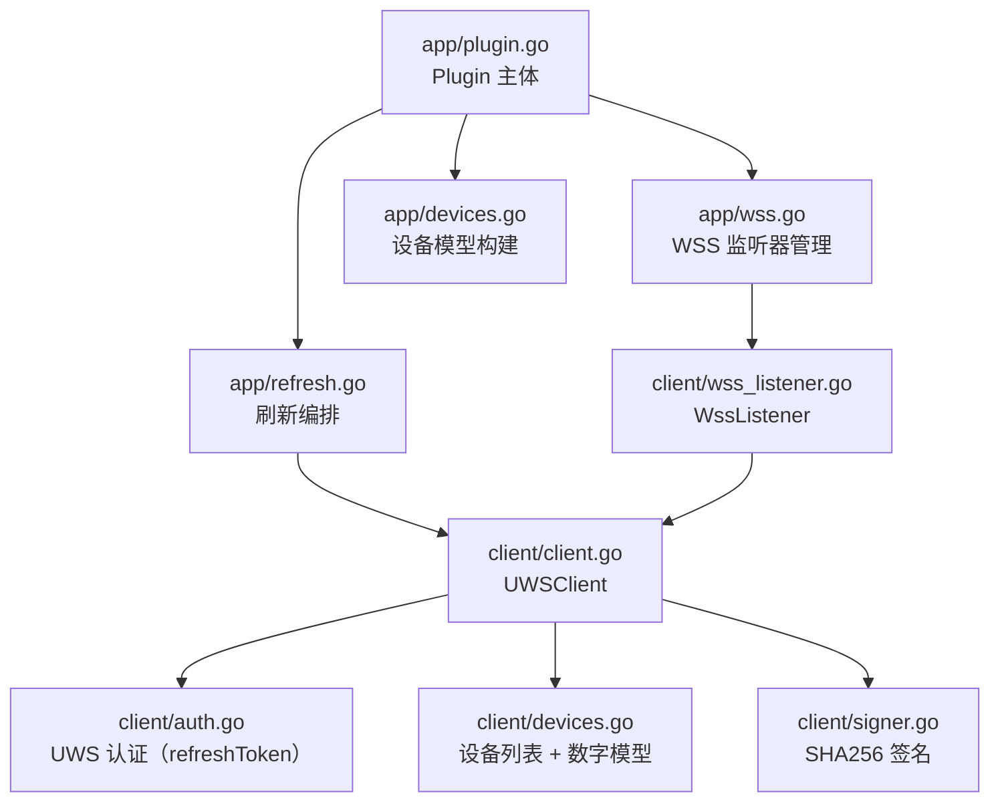

# 技术设计文档：Haier UWS 平台迁移

## 概述

本次迁移将 Haier 插件的认证和 API 层从国际 hOn 平台（Salesforce OAuth + AWS Cognito + api-iot.he.services）完整替换为国内 UWS 平台（uws.haier.net）。迁移后，插件通过 `clientId` + `refreshToken` 配置账户，启动时用 refreshToken 换取 accessToken（仅存内存），所有 HTTP 请求携带 SHA256 签名，设备控制命令通过 WebSocket 发送。

迁移范围仅限 `plugins/haier/` 目录，不涉及 Core 层、gRPC 协议、统一设备模型或 Admin UI。

---

## 架构

### 迁移前（hOn 平台）

```
AccountConfig {email, password, refreshToken, mobileId, timezone}
  → Salesforce OAuth 登录流程（多次 HTTP 重定向）
  → AWS Cognito token 换取
  → api-iot.he.services REST API（设备列表、状态、命令）
  → uws.haier.net WebSocket（仅接收推送）
```

### 迁移后（UWS 平台）

```
AccountConfig {clientId, refreshToken, name?}
  → zj.haier.net refreshToken 换取 accessToken（内存）
  → uws.haier.net REST API（设备列表、数字模型状态）
  → uws.haier.net WebSocket（接收推送 + 发送命令）
```

### 模块关系



---

## 组件与接口

### client/types.go — AccountConfig（精简）

```go
type AccountConfig struct {
    Name         string `json:"name,omitempty"`
    ClientID     string `json:"clientId"`
    RefreshToken string `json:"refresh_token"`
}

func (a AccountConfig) NormalizedName() string
func (a AccountConfig) HasCredentials() bool  // clientId && refreshToken 均非空
```

移除字段：`Email`、`Password`、`MobileID`、`Timezone`。
移除方法：`NormalizedMobileID()`、`NormalizedTimezone()`。

### client/signer.go（新文件）

```go
const (
    uwsAppID  = "MB-SHEZJAPPWXXCX-0000"
    uwsAppKey = "79ce99cc7f9804663939676031b8a427"
)

// Sign 计算 UWS 请求签名。
// urlPath: 请求路径（不含域名和查询参数），如 "/uds/v1/protected/deviceinfos"
// bodyStr: 请求体 JSON 字符串，GET 请求传空字符串
// timestamp: 毫秒级 Unix 时间戳字符串
func Sign(urlPath, bodyStr, timestamp string) string
    // SHA256(urlPath + bodyStr + uwsAppID + uwsAppKey + timestamp)
    // 返回 64 字符十六进制小写字符串
```

### client/auth.go（全部替换）

```go
// uwsAuthState 仅在内存中维护，不持久化 accessToken
type uwsAuthState struct {
    AccessToken  string
    RefreshToken string
    ExpiresAt    time.Time
}

// Authenticate 用 refreshToken 换取 accessToken，结果存入 c.auth
func (c *UWSClient) Authenticate(ctx context.Context) error

// refreshAccessToken 调用 zj.haier.net 刷新接口
func (c *UWSClient) refreshAccessToken(ctx context.Context) error

// CurrentRefreshToken 返回当前内存中的 refreshToken（供 app 层持久化）
func (c *UWSClient) CurrentRefreshToken() string
```

刷新接口：`POST https://zj.haier.net/api-gw/oauthserver/account/v1/refreshToken`
请求体：`{"refreshToken": "<token>", "clientId": "<clientId>"}`

### client/client.go（替换常量和请求头逻辑）

```go
const (
    uwsBaseURL     = "https://uws.haier.net"
    uwsTimezone    = "Asia/Shanghai"
    uwsLanguage    = "zh-cn"
)

type UWSClient struct {
    cfg    AccountConfig
    client *http.Client
    auth   uwsAuthState
}

// requestJSON 构造带完整 UWS 签名头的 HTTP 请求
// 401/token 失效时自动刷新一次后重试
func (c *UWSClient) requestJSON(ctx context.Context, method, urlPath string, body any, out any) error
```

请求头集合（每次请求）：
| 头字段 | 值 |
|---|---|
| `accessToken` | 内存中的 accessToken |
| `appId` | `MB-SHEZJAPPWXXCX-0000` |
| `appKey` | `79ce99cc7f9804663939676031b8a427` |
| `clientId` | 账户 clientId |
| `sequenceId` | `uuid.NewString()` |
| `sign` | `signer.Sign(urlPath, bodyStr, timestamp)` |
| `timestamp` | 毫秒级 Unix 时间戳字符串 |
| `timezone` | `Asia/Shanghai` |
| `language` | `zh-cn` |
| `Content-Type` | `application/json` |

### client/devices.go（替换为 UWS API）

```go
// LoadAppliances 获取设备列表
// GET https://uws.haier.net/uds/v1/protected/deviceinfos
func (c *UWSClient) LoadAppliances(ctx context.Context) ([]map[string]any, error)

// LoadDigitalModels 批量获取设备数字模型状态
// POST https://uws.haier.net/shadow/v1/devdigitalmodels
// body: {"deviceInfoList": [{"deviceId": "..."}]}
func (c *UWSClient) LoadDigitalModels(ctx context.Context, deviceIDs []string) (map[string]map[string]string, error)
```

响应解析：
- `LoadAppliances`：检查 `retCode == "00000"`，解析 `deviceInfoList` 数组
- `LoadDigitalModels`：解析每台设备的 `attributes` 数组（`name`/`value` 键值对）

### client/wss.go（替换连接参数）

```go
const uwsWSSGatewayURL = "https://uws.haier.net/gmsWS/wsag/assign"

// getWSSGatewayURL 获取 WSS 网关地址
// POST body: {"clientId": "<clientId>", "accessToken": "<accessToken>"}
// WSS URL: {agAddr}/userag?token={accessToken}&agClientId={clientId}
func (c *UWSClient) getWSSGatewayURL(ctx context.Context) (string, error)
```

### client/wss_listener.go（替换命令发送）

新增方法：
```go
// SendCommand 通过 WSS 发送设备控制命令
// topic: "BatchCmdReq"
// 连接不可用时返回错误，不降级为 HTTP
func (l *WssListener) SendCommand(ctx context.Context, deviceID string, params map[string]any) error
```

### app/helpers.go — parseAccountConfig（精简）

```go
func parseAccountConfig(entry map[string]any) client.AccountConfig {
    return client.AccountConfig{
        Name:         pluginutil.String(entry["name"], ""),
        ClientID:     firstNonEmpty(pluginutil.String(entry["clientId"], ""), pluginutil.String(entry["client_id"], "")),
        RefreshToken: firstNonEmpty(pluginutil.String(entry["refresh_token"], ""), pluginutil.String(entry["refreshToken"], "")),
    }
}
```

### app/refresh.go — refreshAccount（替换）

```go
func (p *Plugin) refreshAccount(ctx context.Context, account *accountRuntime, nextDevices map[string]*applianceRuntime) error {
    // 1. Authenticate（refreshToken → accessToken）
    // 2. syncAccountConfig（持久化新 refreshToken）
    // 3. LoadAppliances（设备列表）
    // 4. LoadDigitalModels（批量获取数字模型）
    // 5. buildDevice + buildStateSnapshot（构建统一模型）
}
```

---

## 数据模型

### AccountConfig（持久化配置）

```json
{
  "accounts": [
    {
      "name": "home",
      "clientId": "<用户提供>",
      "refresh_token": "<用户提供>"
    }
  ],
  "poll_interval_seconds": 300
}
```

`accessToken` 不出现在持久化配置中。

### uwsAuthState（内存运行时）

```go
type uwsAuthState struct {
    AccessToken  string    // 仅内存，不持久化
    RefreshToken string    // 刷新后同步到 AccountConfig 并持久化
    ExpiresAt    time.Time // 可选，用于主动刷新判断
}
```

### 设备列表响应（GET /uds/v1/protected/deviceinfos）

```json
{
  "retCode": "00000",
  "retInfo": "成功",
  "deviceInfoList": [
    {
      "deviceId": "...",
      "deviceName": "...",
      "deviceType": "...",
      "online": true
    }
  ]
}
```

### 数字模型响应（POST /shadow/v1/devdigitalmodels）

```json
{
  "retCode": "00000",
  "deviceDigitalModelList": [
    {
      "deviceId": "...",
      "attributes": [
        {"name": "machMode", "value": "0"},
        {"name": "prCode", "value": "1"}
      ]
    }
  ]
}
```

### WSS 命令消息（BatchCmdReq）

```json
{
  "agClientId": "<clientId>",
  "topic": "BatchCmdReq",
  "content": {
    "deviceId": "<deviceId>",
    "sn": "<uuid>",
    "cmdList": [
      {"name": "<paramName>", "value": "<paramValue>"}
    ]
  }
}
```

---

## 正确性属性

*属性（Property）是在系统所有有效执行路径上都应成立的特征或行为——本质上是对系统应做什么的形式化陈述。属性是人类可读规范与机器可验证正确性保证之间的桥梁。*

### 属性 1：签名确定性与格式

*对于任意* urlPath、bodyStr、timestamp 输入，`Sign()` 函数应始终产生相同的、长度恰好为 64 的十六进制小写字符串（仅含 `[0-9a-f]` 字符）。

**验证需求：2.1、2.3、2.4、2.5**

### 属性 2：token 刷新响应解析往返

*对于任意* 合法的 refreshToken 刷新响应 JSON（包含 `accessToken` 和 `refreshToken` 字段），解析后提取的两个字段值应与响应中对应字段值完全一致。

**验证需求：3.1、3.3、10.5**

### 属性 3：设备列表解析完整性

*对于任意* 包含 N 台设备的合法 `/deviceinfos` 响应（`retCode == "00000"`），`LoadAppliances` 应返回恰好 N 个条目，且每个条目均包含非空的 `deviceId`。

**验证需求：4.2**

### 属性 4：非零 retCode 返回错误

*对于任意* `retCode` 不等于 `"00000"` 的设备列表响应，`LoadAppliances` 应返回非 nil 错误，且错误信息包含该 retCode 值。

**验证需求：4.4**

### 属性 5：数字模型属性解析往返

*对于任意* 合法的数字模型响应，`LoadDigitalModels` 解析后每台设备的属性键值对数量应等于响应中该设备 `attributes` 数组的长度，且所有 `name` 非空的属性均被保留。

**验证需求：5.2**

### 属性 6：空白凭证拒绝

*对于任意* `clientId` 或 `refreshToken` 为空字符串或纯空白字符串的 `AccountConfig`，`HasCredentials()` 应返回 false，且 `ValidateConfig` 应返回非 nil 错误。

**验证需求：1.3、1.4**

### 属性 7：WSS 消息解码往返

*对于任意* 合法的 `GenMsgDown/DigitalModel` WSS 消息（经过 base64 → JSON → base64 → gzip → JSON 编码），`parseWSSDeviceUpdate` 解码后应得到非空的 `deviceId` 和与原始属性列表一致的键值对集合。

**验证需求：6.4**

### 属性 8：状态映射确定性

*对于任意* 包含 `machMode` 字段的数字模型属性集，`buildStateSnapshot` 应将 `"0"` 映射为 `"idle"`，`"3"` 映射为 `"paused"`，其他任意值映射为 `"running"`，且映射结果与输入一一对应（确定性）。

**验证需求：7.1、7.3**

### 属性 9：持久化幂等性

*对于任意* refreshToken 未发生变化的账户运行时，`syncAccountConfig` 不应触发 `coreapi.PersistPluginConfig` 调用（幂等性：相同 token 不产生写操作）。

**验证需求：8.2**

---

## 错误处理

| 场景 | 处理方式 |
|---|---|
| refreshToken 换取 accessToken 失败（网络/token 失效） | 返回明确认证错误，不重试，不降级 |
| HTTP 请求返回 401 | 自动刷新 accessToken 后重试一次；二次失败则返回错误 |
| 设备列表 `retCode != "00000"` | 返回包含 retCode 和 retInfo 的错误 |
| 数字模型某台设备数据缺失 | 跳过该设备，继续处理其他设备 |
| WSS 连接断开 | 30 秒后重连，重连前重新刷新 token 和获取网关地址 |
| WSS 不可用时发送命令 | 返回命令失败错误，不降级为 HTTP |
| `clientId` 或 `refreshToken` 为空 | `ValidateConfig` 返回明确配置错误，拒绝启动 |

---

## 测试策略

### 单元测试

- `client/signer_test.go`：已知输入 → 已知签名输出（固定向量验证）
- `client/auth_test.go`：token 刷新响应解析（模拟 HTTP 响应体）
- `client/devices_test.go`：设备列表和数字模型响应解析
- `app/helpers_test.go`：`parseAccountConfig` 字段映射

### 属性测试

使用 `pgregory.net/rapid`（Go 属性测试库，已在 go.mod 中或可添加）。每个属性测试最少运行 100 次迭代。

| 测试文件 | 属性 | 标注 |
|---|---|---|
| `client/signer_test.go` | 属性 1：签名确定性与格式 | `Feature: haier-uws-platform-migration, Property 1: 签名确定性与格式` |
| `client/auth_test.go` | 属性 2：token 刷新响应解析往返 | `Feature: haier-uws-platform-migration, Property 2: token 刷新响应解析往返` |
| `client/devices_test.go` | 属性 3：设备列表解析完整性 | `Feature: haier-uws-platform-migration, Property 3: 设备列表解析完整性` |
| `client/devices_test.go` | 属性 4：非零 retCode 返回错误 | `Feature: haier-uws-platform-migration, Property 4: 非零 retCode 返回错误` |
| `client/devices_test.go` | 属性 5：数字模型属性解析往返 | `Feature: haier-uws-platform-migration, Property 5: 数字模型属性解析往返` |
| `client/types_test.go` | 属性 6：空白凭证拒绝 | `Feature: haier-uws-platform-migration, Property 6: 空白凭证拒绝` |
| `client/wss_test.go` | 属性 7：WSS 消息解码往返 | `Feature: haier-uws-platform-migration, Property 7: WSS 消息解码往返` |
| `app/devices_test.go` | 属性 8：状态映射确定性 | `Feature: haier-uws-platform-migration, Property 8: 状态映射确定性` |
| `app/refresh_test.go` | 属性 9：持久化幂等性 | `Feature: haier-uws-platform-migration, Property 9: 持久化幂等性` |

### 编译验证

```bash
go build ./plugins/haier/...
go vet ./plugins/haier/...
go test ./plugins/haier/... -run TestUnit
```

### 集成验证（需真实凭证）

提供有效 `clientId` 和 `refreshToken` 后，`DiscoverDevices` 应返回至少一台设备，且设备状态包含 `machMode` 字段。
