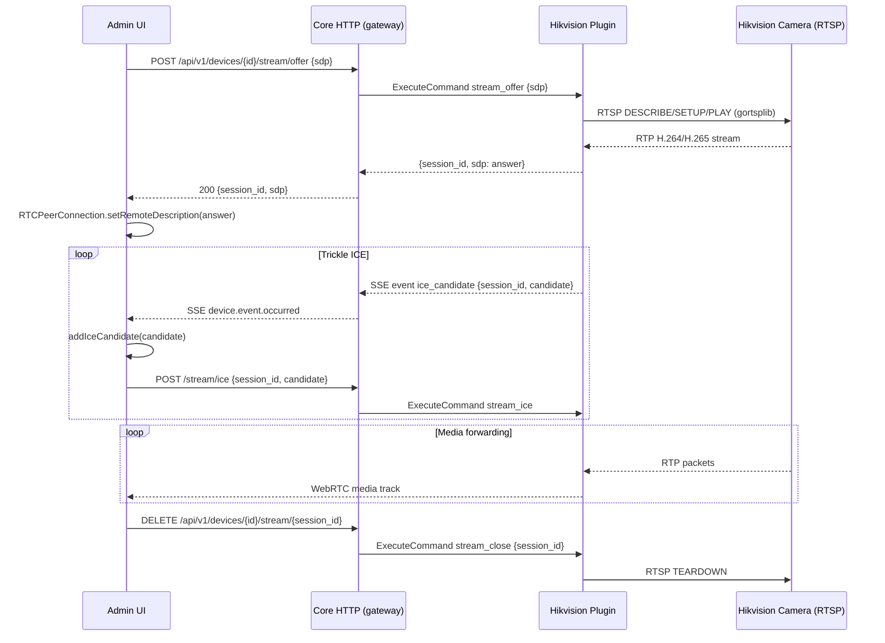

# Design Document: hikvision-rtsp-webrtc

## Overview

This feature adds live RTSP-to-WebRTC stream relay for Hikvision cameras. The Hikvision plugin process opens a real RTSP connection to the camera using `gortsplib`, bridges the H.264/H.265 (and optional audio) RTP packets into a `pion/webrtc` PeerConnection, and returns an SDP answer to the browser. The Core gateway exposes three new HTTP signalling endpoints. The admin UI renders a live video element using the browser's native WebRTC APIs.

The architecture boundary is strict: the plugin owns all RTSP and WebRTC logic; Core owns the HTTP surface, policy, and audit; the admin UI communicates only through the gateway HTTP API and the existing SSE event stream.

## Architecture



### Component Boundaries

- **Plugin** (`plugins/hikvision/internal/app/`): owns `RTSP_Relay` — all gortsplib and pion/webrtc logic lives here. New files: `stream_relay.go`, `stream_commands.go`.
- **Core HTTP** (`internal/api/http/`): new file `stream.go` with three handlers. Routes registered in `server.go`.
- **Core Gateway** (`internal/api/gateway/`): `SendDeviceCommand` already routes to plugin; stream actions reuse this path unchanged.
- **Admin UI** (`web/admin/src/`): new `StreamViewerPanel.tsx` component and `useStreamSession.ts` hook.

## Components and Interfaces

### Plugin: RTSP_Relay (`stream_relay.go`)

```go
type StreamSession struct {
    ID           string
    EntryID      string
    PC           *webrtc.PeerConnection
    RTSPClient   *gortsplib.Client
    LastActivity time.Time
    cancel       context.CancelFunc
}

type RTSPRelay struct {
    mu       sync.Mutex
    sessions map[string]*StreamSession   // keyed by session_id
    maxSessions    int
    idleTimeout    time.Duration
    emitEvent      func(models.Event)
    stopCleanup    context.CancelFunc
}

func NewRTSPRelay(maxSessions int, idleTimeout time.Duration, emit func(models.Event)) *RTSPRelay
func (r *RTSPRelay) Offer(ctx context.Context, entryID string, cfg CameraConfig, sdpOffer string) (sessionID string, sdpAnswer string, err error)
func (r *RTSPRelay) Close(sessionID string) error
func (r *RTSPRelay) AddICECandidate(sessionID string, candidate string) error
func (r *RTSPRelay) CloseAll()
func (r *RTSPRelay) startCleanupLoop(ctx context.Context)
```

### Plugin: Stream Commands (`stream_commands.go`)

Handles the three stream actions dispatched from `commands.go`:

```go
func (p *Plugin) handleStreamOffer(ctx context.Context, runtime *entryRuntime, params map[string]any) (map[string]any, string, error)
func (p *Plugin) handleStreamClose(params map[string]any) (map[string]any, string, error)
func (p *Plugin) handleStreamICE(params map[string]any) (map[string]any, string, error)
```

`commands.go` switch cases delegate to these functions. The `Plugin` struct gains a `relay *RTSPRelay` field, initialized in `Setup` and torn down in `Stop`.

### Core HTTP: Stream Handlers (`internal/api/http/stream.go`)

```go
func (s *Server) handleStreamOffer(w http.ResponseWriter, r *http.Request)
func (s *Server) handleStreamClose(w http.ResponseWriter, r *http.Request)
func (s *Server) handleStreamICE(w http.ResponseWriter, r *http.Request)
```

Routes added to `server.go`:
```
POST   /api/v1/devices/{id}/stream/offer
DELETE /api/v1/devices/{id}/stream/{session_id}
POST   /api/v1/devices/{id}/stream/ice
```

Each handler:
1. Resolves the device and checks `"stream"` capability → 422 if absent.
2. Checks plugin is running → 503 if not.
3. Calls `s.gateway.SendDeviceCommand` with the appropriate action.
4. Writes the response or error.

`stream_offer` and `stream_close` are audit-logged via the existing gateway path.

### Admin UI: `useStreamSession.ts`

```ts
interface StreamSession {
  sessionId: string | null
  state: 'idle' | 'connecting' | 'active' | 'error'
  errorMessage: string | null
  videoRef: RefObject<HTMLVideoElement>
}

function useStreamSession(deviceId: string): {
  session: StreamSession
  startStream: () => Promise<void>
  stopStream: () => Promise<void>
  handleIceCandidate: (candidate: RTCIceCandidateInit) => void
}
```

The hook:
- Creates `RTCPeerConnection`, generates an SDP offer, POSTs to `/stream/offer`.
- Sets the returned SDP answer as remote description.
- Sends local ICE candidates to `/stream/ice`.
- Listens for SSE `device.event.occurred` events with `event_type: "ice_candidate"` and calls `addIceCandidate`.
- On stop or unmount, calls `DELETE /stream/{session_id}` and closes the PC.

### Admin UI: `StreamViewerPanel.tsx`

Rendered inside `DeviceWorkspace.tsx` when `device.capabilities.includes("stream")`. Shows:
- "Live View" button when idle.
- `<video>` element + "Stop" button when active.
- Error message when in error state.

## Data Models

### New config fields on `CameraConfig`

```go
MaxStreamSessions       int  // default 4, min 1
StreamIdleTimeoutSeconds int  // default 60, min 10
```

Parsed in `config.go` `parseEntryConfig`. Defaults applied in `parseEntryConfig`; relay constructed in `Setup`.

### Stream command payloads (through existing `models.CommandRequest.Params`)

| Action | Params | Response payload |
|---|---|---|
| `stream_offer` | `{"sdp": "<offer>"}` | `{"session_id": "<id>", "sdp": "<answer>"}` |
| `stream_close` | `{"session_id": "<id>"}` | `{"closed": true}` |
| `stream_ice` | `{"session_id": "<id>", "candidate": "<string>"}` | `{"accepted": true}` |

### SSE event payloads emitted by plugin

```json
// ICE candidate
{
  "event_type": "ice_candidate",
  "session_id": "<id>",
  "candidate": "<ICE candidate string>"
}

// Stream disconnected (RTSP drop)
{
  "event_type": "stream_disconnected",
  "session_id": "<id>"
}

// Idle timeout
{
  "event_type": "stream_timeout",
  "session_id": "<id>"
}
```

All emitted as `models.EventDeviceOccurred` events, flowing through the existing plugin event channel → Core EventBus → SSE.

### RTSP URL construction (internal to plugin, never exposed)

```
rtsp://<Username>:<Password>@<Host>:<RTSPPort><RTSPPath>
```

`{channel}` in `RTSPPath` is substituted with the integer `Channel` value. The `rtsp_url` field in device state contains only `<Host>:<RTSPPort>` without credentials.

