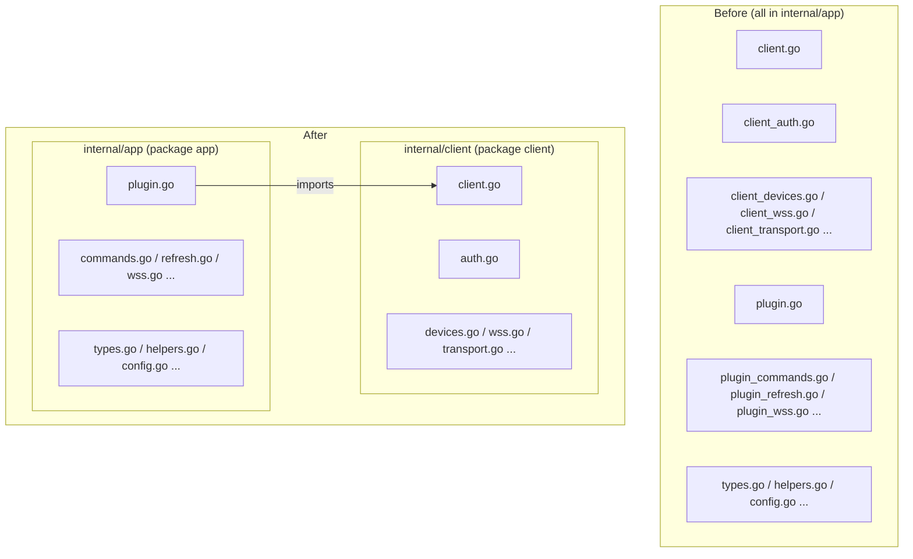
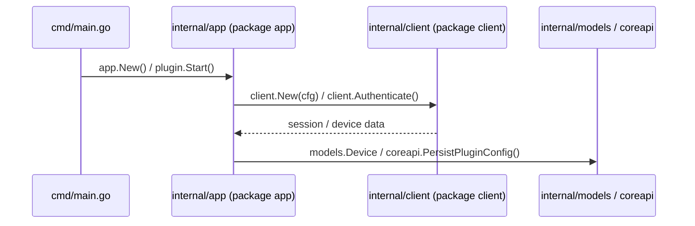

# Design Document: plugin-dir-refactor

## Overview

This refactor reorganizes the `internal/app` directory inside each plugin (`haier`, `hikvision`, `petkit`) by splitting files into two sub-packages:

- `internal/client` — all files whose primary subject is the vendor HTTP/WebSocket/MQTT client (auth, transport, device API calls, connection management)
- `internal/app` — all files whose primary subject is the plugin runtime (the `Plugin` struct, lifecycle, command dispatch, state sync, event emission, config persistence)

Files that currently carry a `plugin_` prefix in their name are moved to `internal/app` with that prefix stripped. Files that currently carry a `client_` prefix (or are clearly client-only) are moved to `internal/client`. Shared types that are referenced by both packages stay in `internal/app` unless they are exclusively used by the client, in which case they move to `internal/client`.

The `xiaomi` plugin already follows this pattern (`internal/app` + `internal/cloud` + `internal/mapper` + `internal/spec`) and is **not** changed.

---

## Architecture

---

## Sequence Diagrams

### Import chain after refactor

---

## Components and Interfaces

### haier

#### internal/client (new package)

| New filename | Source file | Notes |
|---|---|---|
| `client.go` | `client.go` | `haierClient` struct, constructor, `requestJSON` |
| `auth.go` | `client_auth.go` | `authenticate`, `refresh`, `loginWithPassword`, etc. |
| `devices.go` | `client_devices.go` | `loadAppliances`, `loadCommands`, `loadAttributes`, `sendCommand`, etc. |
| `wss.go` | `client_wss.go` | `getWSSGatewayURL`, `parseWSSDeviceUpdate`, `wssMessage` |
| `helpers.go` | `client_helpers.go` | `stringFromAny`, `applianceOptions`, `timezoneOffset`, etc. |
| `wss_listener.go` | `wss_listener.go` | `wssListener` struct (depends only on `haierClient`) |

#### internal/app (retained package)

| New filename | Source file | Notes |
|---|---|---|
| `plugin.go` | `plugin.go` | `Plugin` struct, `New`, `Manifest`, `Setup`, `Start`, `Stop`, `HealthCheck`, `DiscoverDevices`, `ExecuteCommand`, `Events` |
| `commands.go` | `plugin_commands.go` | `commandForRequest`, `buildCapabilities`, etc. |
| `controls.go` | `plugin_controls.go` | `buildControlSpecs` |
| `devices.go` | `plugin_devices.go` | `buildDevice`, `buildStateSnapshot` |
| `helpers.go` | `plugin_helpers.go` | `parseAccountConfig`, `extractParameters`, `cloneMap`, `intFromAny`, etc. |
| `refresh.go` | `plugin_refresh.go` | `refreshAll`, `refreshSingle`, `refreshAccount`, `syncAccountConfig`, `snapshot`, etc. |
| `wss.go` | `plugin_wss.go` | `startWSSListeners`, `applyWSSUpdate`, `allWSSConnected` |
| `types.go` | `types.go` | `AccountConfig`, `Config`, `accountRuntime`, `applianceRuntime` |

**Import change in `internal/app`:** all references to `haierClient`, `wssListener`, `newHaierClient`, `newWSSListener`, `parseWSSDeviceUpdate`, `getWSSGatewayURL`, `stringFromAny`, `applianceOptions`, etc. must be qualified with the `client` package import path `github.com/chentianyu/celestia/plugins/haier/internal/client`.

---

### hikvision

#### internal/client (new package)

| New filename | Source file | Notes |
|---|---|---|
| `client.go` | `client.go` | `cameraClient` interface, `newCameraClient` factory |
| `stub.go` | `client_stub.go` | stub implementation |
| `unsupported.go` | `client_unsupported.go` | unsupported-platform shim |
| `hcnet_client_linux.go` | `hcnet_client_linux.go` | real HCNet SDK client (Linux/CGo) |
| `hcnet_cgo_linux.go` | `hcnet_cgo_linux.go` | CGo declarations |
| `hcnet_types_compat.h` | `hcnet_types_compat.h` | C header (stays alongside CGo file) |

#### internal/app (retained package)

| New filename | Source file | Notes |
|---|---|---|
| `plugin.go` | `plugin.go` | `Plugin` struct, lifecycle, `ExecuteCommand`, `Events` |
| `commands.go` | `commands.go` | `executeCommand`, `shortPTZ`, `playbackControl` |
| `stream_commands.go` | `stream_commands.go` | `handleStreamRTSPURL` |
| `config.go` | `config.go` | `Config`, `CameraConfig`, `parseConfig` |
| `device.go` | `device.go` | `buildDevice`, `buildState`, `buildControlSpecs` |
| `helpers.go` | `helpers.go` | `cloneMap`, `stateChanged`, `stringParam`, `intParam`, etc. |

**Import change in `internal/app`:** `cameraClient`, `newCameraClient`, `cameraStatus` move to `internal/client`; `plugin.go` imports `github.com/chentianyu/celestia/plugins/hikvision/internal/client`.

---

### petkit

#### internal/client (new package)

| New filename | Source file | Notes |
|---|---|---|
| `client.go` | `client.go` | `Client` struct, `NewClient` |
| `auth.go` | `client_auth.go` | `ensureSession`, `login`, `resolveBaseURL`, `CurrentSession`, etc. |
| `commands.go` | `client_commands.go` | command execution methods |
| `controls.go` | `client_controls.go` | control helpers |
| `feeder.go` | `client_feeder.go` | feeder-specific API calls |
| `mapping.go` | `client_mapping.go` | device mapping helpers |
| `paths.go` | `client_paths.go` | API path constants/helpers |
| `sync.go` | `client_sync.go` | `Sync`, `RefreshDevice`, `RefreshDeviceByID` |
| `transport.go` | `client_transport.go` | `doRequest`, `getSessionJSON`, `getPublicJSON` |
| `mqtt.go` | `mqtt.go` | `mqttListener`, `newMQTTListener`, `aliyunSign`, `fetchIoTMQTTConfig` |

#### internal/app (retained package)

| New filename | Source file | Notes |
|---|---|---|
| `plugin.go` | `plugin.go` | `Plugin` struct, `New`, `Manifest`, `Setup`, `ValidateConfig`, `Events` |
| `runtime.go` | `plugin_runtime.go` | `Start`, `Stop`, `HealthCheck`, `DiscoverDevices`, `ListDevices`, `GetDeviceState`, `ExecuteCommand`, `pollLoop` |
| `sync.go` | `plugin_sync.go` | `refreshAll`, `refreshDeviceIfNeeded`, `applyAccountSnapshots`, `applySnapshot`, `emitLocked`, etc. |
| `mqtt.go` | `plugin_mqtt.go` | `startMQTTListeners`, `startAccountMQTT`, `allMQTTConnected` |
| `events.go` | `plugin_events.go` | `emitSnapshotEventLocked` |
| `config.go` | `plugin_config.go` | `parseConfig`, `syncAccountSession`, `accountKey`, etc. |

**Import change in `internal/app`:** `Client`, `NewClient`, `mqttListener`, `newMQTTListener`, `iotMQTTConfig`, `sessionInfo`, `petkitDeviceInfo`, `petkitRequestError` move to `internal/client`; `plugin.go` and related files import `github.com/chentianyu/celestia/plugins/petkit/internal/client`.

---

## Data Models

No data model changes. All `models.Device`, `models.DeviceStateSnapshot`, `models.Event`, and `models.CommandRequest/Response` types remain in `internal/models` and are unchanged.

Plugin-internal types (`AccountConfig`, `Config`, `accountRuntime`, `applianceRuntime`, `deviceSnapshot`, etc.) stay in `internal/app` of each plugin because they are used by both the plugin runtime and the client setup code.

Types that are exclusively used inside the client (e.g. `haierAuthState`, `wssMessage`, `iotMQTTConfig`, `sessionInfo`, `cameraStatus`, `cameraClient`) move to `internal/client`.

---

## Error Handling

No changes to error handling semantics. All existing error propagation paths are preserved. The refactor is purely structural.

---

## Testing Strategy

### Unit Testing Approach

Existing test files (`config_test.go`, `stream_commands_test.go`, `client_feeder_test.go`, `client_test.go`, `plugin_test.go`) are moved to the appropriate new package:

- Tests for client types → `internal/client/`
- Tests for plugin runtime types → `internal/app/`

Package declarations in test files are updated to match the new package name (`package client` or `package app`).

### Property-Based Testing Approach

Not applicable for this structural refactor.

### Integration Testing Approach

The existing `cmd/main_test.go` for hikvision and any integration-level tests remain in `cmd/` and continue to import `internal/app` as before (no change needed there since `cmd/main.go` only imports `internal/app`).

---

## Performance Considerations

None. This is a pure directory/package reorganization with no runtime behavior changes.

---

## Security Considerations

None. No auth logic, credential handling, or transport behavior is changed.

---

## Dependencies

No new external dependencies. The only new import paths are intra-module paths within each plugin tree:

- `github.com/chentianyu/celestia/plugins/haier/internal/client`
- `github.com/chentianyu/celestia/plugins/hikvision/internal/client`
- `github.com/chentianyu/celestia/plugins/petkit/internal/client`

---

## Correctness Properties

*A property is a characteristic or behavior that should hold true across all valid executions of a system — essentially, a formal statement about what the system should do. Properties serve as the bridge between human-readable specifications and machine-verifiable correctness guarantees.*

### Property 1: 文件移动的互斥性（Move Exclusivity）

For any file that is designated to move from `internal/app` to `internal/client`, after the refactor that file SHALL exist in `internal/client` and SHALL NOT exist in `internal/app`.

**Validates: Requirements 1.2, 1.3, 1.4, 1.5, 1.6, 1.7, 1.8, 3.2, 3.3, 3.4, 3.5, 3.6, 3.7, 3.8, 5.2, 5.3, 5.4, 5.5, 5.6, 5.7, 5.8, 5.9, 5.10, 5.11, 5.12**

### Property 2: 构建正确性（Build Correctness）

For all three refactored plugins (`haier`, `hikvision`, `petkit`) and the root module, the Go build system SHALL produce zero compile errors after the refactor is complete. A compile error in any package indicates an unresolved import path or unqualified symbol reference.

**Validates: Requirements 2.7, 4.1, 6.6, 8.1, 8.2, 8.4**

### Property 3: 测试通过性（Test Pass）

For all test files in `plugins/haier/...`, `plugins/hikvision/...`, and `plugins/petkit/...`, the Go test runner SHALL report zero failures after the refactor. A test failure indicates either a wrong package declaration or a broken import reference.

**Validates: Requirements 7.1, 7.2, 7.3, 7.4, 7.5, 8.3**

### Property 4: xiaomi 不变性（Xiaomi Invariant）

For every file under `plugins/xiaomi/`, the file content and path SHALL be identical before and after the refactor. No file under `plugins/xiaomi/` SHALL be created, modified, or deleted.

**Validates: Requirements 9.1, 9.2**
